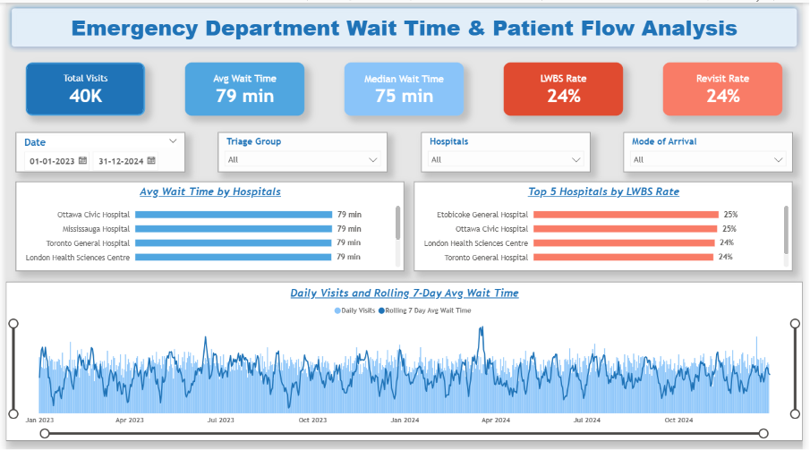
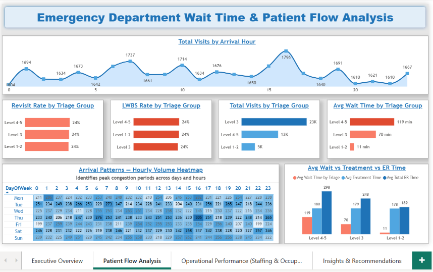
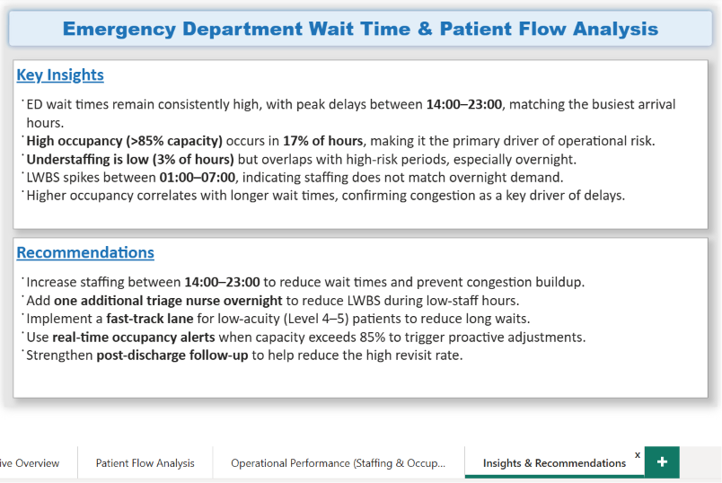

# Emergency Department Wait Time & Patient Flow Analysis  
### Power BI | SQL | Python | DAX | Data Modeling | Healthcare Analytics

This project analyzes Emergency Department (ED) performance across multiple hospitals, focusing on wait times, patient flow, staffing, occupancy, and operational risk.  
The goal is to identify bottlenecks, quantify delays, and provide actionable recommendations to improve ED efficiency.

# Dashboard Link: 
https://app.powerbi.com/groups/59081ef8-bae4-4c3b-a9dd-db597f653281/reports/b9a0be1d-7584-43d2-be82-ab3f218d7b26/24687037576909208759?experience=power-bi
---

## Project Overview
This end‑to‑end analytics project covers the full data lifecycle:

- Data cleaning & preprocessing (Python)
- Data validation & transformation (SQL)
- Data modeling & relationships (Power BI)
- DAX measures for KPIs and time intelligence
- Multi‑page interactive dashboard
- Insights & recommendations for hospital operations

The dataset includes **40,000+ ED visits** across **2023–2024**.

---
## Data Pipeline Overview (High‑Level)

### **1. Python — Data Cleaning**
- Removed duplicates  
- Handled missing values  
- Standardized date/time fields  
- Created engineered features (Arrival Hour, Total ER Time)

### **2. SQL — Data Validation & Transformation**
- Loaded cleaned dataset into SQL Server  
- Validated row counts, triage distributions, and timestamp logic  
- Created analytical tables using joins & window functions  
- Ensured referential integrity before loading into Power BI  

### **3. Power BI — Data Modeling**
- Built a star schema (Fact table + Calendar + Hospital dimension)  
- Created relationships & hierarchies  
- Performed data profiling in Power Query  

### **4. DAX — Measures for KPIs & Visuals**
- Time intelligence (rolling averages)  
- LWBS & Revisit rates  
- Triage‑level metrics  
- Operational risk calculations  

### **5. Dashboard Development**
- Designed 4 interactive pages  
- Added slicers, bookmarks, navigation  
- Applied custom theme & formatting  

### **6. Deployment**
- Published to Power BI Service  
- Enabled auto‑refresh  

---

## Dashboard Pages

### **1. Executive Overview**
High‑level KPIs summarizing ED performance:
- Total Visits: **40K**
- Avg Wait Time: **79 min**
- Median Wait Time: **75 min**
- LWBS Rate: **24%**
- Revisit Rate: **24%**

Key visuals:
- Avg Wait Time by Hospital  
- Top 5 Hospitals by LWBS Rate  
- Daily Visits + Rolling 7‑Day Avg Wait Time  

---

### **2. Patient Flow Analysis**
- Total Visits by Arrival Hour  
- Revisit Rate by Triage Group  
- LWBS Rate by Triage Group  
- Avg Wait Time by Triage Group  
- Hourly Volume Heatmap  
- Avg Wait vs Treatment vs Total ER Time  

---

### **3. Operational Performance (Staffing & Occupancy)**
- Staffing Level Over Time  
- ER Occupancy Over Time  
- Avg Wait Time by Hour  
- LWBS by Hour  
- Understaffed Hours  
- Occupancy vs Wait Time (correlation)  
- Operational Risk Breakdown  

---

### **4. Insights & Recommendations**
Key insights:
- Peak delays occur between **14:00–23:00**
- High occupancy (>85%) drives longer wait times
- Understaffing overlaps with overnight LWBS spikes
- Strong correlation between occupancy & wait time

Recommendations:
- Increase staffing during peak hours  
- Add overnight triage nurse  
- Implement fast‑track lane for low‑acuity patients  
- Use real‑time occupancy alerts  
- Improve post‑discharge follow‑up  

---

## Key DAX Measures Used

### Total Visits
    Total Visits = COUNTROWS('er_visits')

### Avg Wait Time
    Avg Wait Time = AVERAGE(er_visits[Wait Minutes Clean])

### Median Wait Time
    Median Wait Time = MEDIAN('er_visits'[Wait Minutes Clean])

### LWBS Rate %
    LWBS Rate % = 
    VAR denominator = CALCULATE(COUNTROWS('er_visits'), NOT(ISBLANK('er_visits'[left_without_being_seen])))
    RETURN IF(denominator=0, BLANK(), DIVIDE([LWBS Count], denominator) * 100)

### Revisit Rate %
    Revisit 72h Rate % = DIVIDE([Revisit 72h Count], [Total Visits], 0) * 100

### Rolling 7-Day Avg Wait Time
    Rolling 7 Day Avg Wait Time = 
    AVERAGEX(
    DATESINPERIOD('Calendar'[Date], MAX('Calendar'[Date]), -6, DAY),
    [Avg Wait Time]
    )

---

## Folder Structure

    /data
    er_visits_clean
    er_hourly_metrics_clean
    hospitals_clean
    physicians_clean
    nurses_clean
    beds_clean

    /sql
    01_schema
    02_bulk_insert
    03_data_cleaning
    04_analysis_queries

    /powerbi
    ER Wait Time Analysis.pbix

    /images
    Page 1 - Executive Overview
    Page 2 - Patient Flow Analysis
    Page 3 - Operational Performance (Staffing & Occupancy)
    Page 4 - Insights & Recommendations

    README.md

---

## Dashboard Screenshots 

.png)

---

## Skills Demonstrated
- End‑to‑end Power BI project execution  
- Healthcare operations analysis  
- Data modeling & star schema design  
- DAX (time intelligence, KPIs, measures)  
- Python data cleaning  
- SQL analytical queries  
- Dashboard storytelling  
- Insight generation  

---
